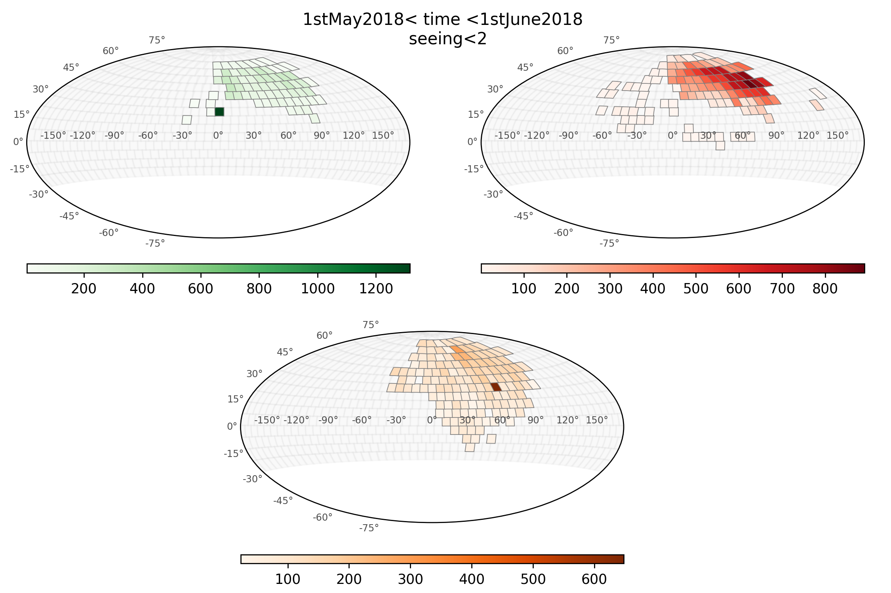
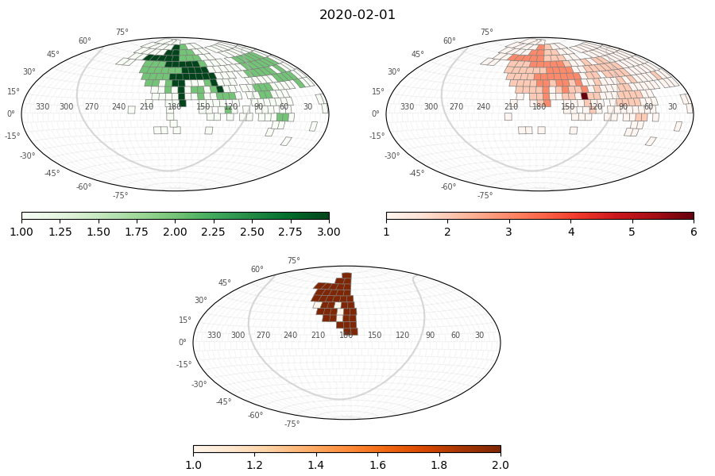
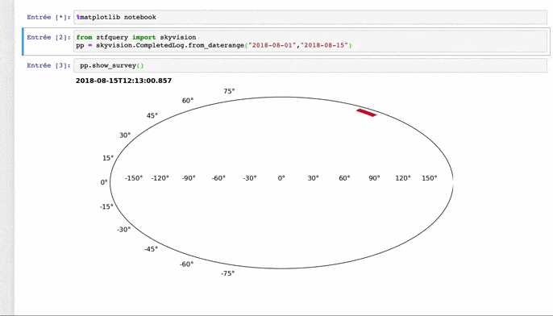
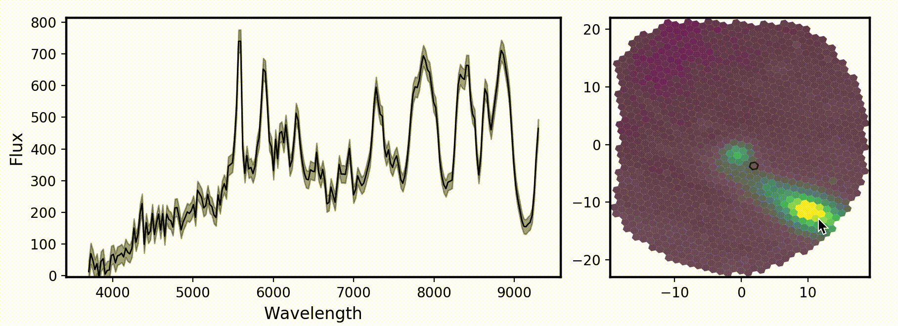
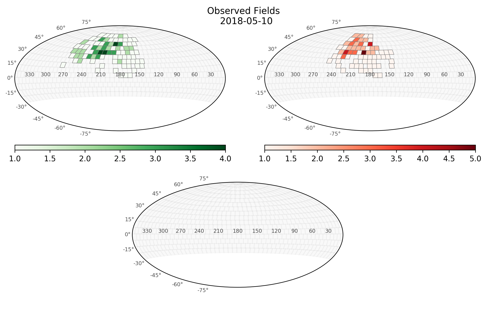

# ztfquery

[](https://pypi.python.org/pypi/ztfquery)

[](https://doi.org/10.5281/zenodo.1345222)

**ztfquery is a python tool to access ztf (and SEDM) data. It contains**:

- **ZTF products:** a wrapper of the [IRSA web API](https://irsa.ipac.caltech.edu/docs/program_interface/ztf_api.html) that enable to get ztf data _(requires access for full data, but not public data)_:
	- Images and pipeline products, e.g. catalog ;
	- LightCurves (not from image subtraction).
	- ZTF observing logs _(requires special access)_

- **Marshal Data:** tools to download [Marshal](http://skipper.caltech.edu:8080/cgi-bin/growth/marshal.cgi) data, including alert lightcurves and target coordinates _(requires access)_

- **SEDM Data:** tools to download SEDM data, including IFU cubes and target spectra, from [pharos](http://pharos.caltech.edu) _(requires access)_

- **ZTF alert:** Currently only a simple alert reader.

- **Fritz Data**: see [documentation](doc/fritz.md)

### Citing 

Mickael Rigault. (2018, August 14). ztfquery, a python tool to access ZTF data (Version doi). Zenodo. http://doi.org/10.5281/zenodo.1345222

### Acknowledgment

If you have used `ztfquery` for a research you are publishing, please **include the following in your acknowledgments**:
_"The ztfquery code was funded by the European Research Council (ERC) under the European Union's Horizon 2020 research and innovation programme (grant agreement n°759194 - USNAC, PI: Rigault)."_

## Credit

M. Rigault (corresponding author, m.rigault@ipnl.in2p3.fr, CNRS/IN2P3), with help from M. Giomi (Humboldt Universiteat zu Berlin) and U. Feindt (Oskar Klein Center, Stockholm University) 


# Installation

using pip: `pip install ztfquery` (favored)

or for the latest version:

go wherever you want to save the folder and then
```bash
git clone https://github.com/MickaelRigault/ztfquery.git
cd ztfquery
python setup.py install
```

Your credentials will requested the first time you want to access a service (IRSA, Marshal, etc.). They will then be stored, crypted, under ~/.ztfquery. 
use `ztfquery.io.set_account(servicename)` to reset it.

You can also directly provide account settings when running `load_metadata` and `download_data` using the `auth=[your_username, your_password]` parameter. Similarly, directly provide the username and password to the ztf ops page when loading `NightSummary` using the `ztfops_auth` parameter.

### Setting your I/O

You should also create the global variable `$ZTFDATA` (usually in your `~/.bash_profile` or `~/.cshrc`). Data you will download from IRSA will be saved in the directory indicated by `$ZTFDATA` following the IRSA data structure.


***

# Getting ZTF Data from IRSA | Examples

## Generic Query

The Generic ZTF data access query uses the `ZTFQuery` object.
Being able to download data requires two steps: 
  1. do the query to know which data are accessible (this uses the `load_metadata()` method.
  2. do the actual download of the accessible data (this uses the `download_data()` method).

Other methods enables you to further see want is going on (like the plotting method `show_gri_fields()`) or check what has already be downloaded and were that is on your computer (`get_local_data()`).

### Example 1 generic SQL, no coordinate in particular.
In this example, we are going to query any thing that have been observed with a *seeing lower than 2arcsec between the 1st of May 2018 and the 1st of June 2018*.
```python
from ztfquery import query
zquery = query.ZTFQuery()
# Check what are the Julian Dates of 1st of May 2018 and 1st of June 2018
from astropy import time
jd_1may18 = time.Time("2018-05-01").jd # 2458239.5
jd_1june18 = time.Time("2018-06-01").jd # 2458270.5
# Do the Query to see what exists
zquery.load_metadata(sql_query="seeing<2 and obsjd BETWEEN 2458239.5 AND 2458270.5") # this will take about 1min

# The information is save as Pandas DataFrame undern `metatable`
zquery.metatable # it contains about 50 000 entries...
# Show the observed fields, limiting it to the main (or primary) grid for visibility (say grid="secondary" to see this rest):
zquery.show_gri_fields(title="1stMay2018< time <1stJune2018 \n seeing<2", grid="main")
"""
In this figure, the colorbar shows the number of time a given field in in metatable. 
Remark that each field is made of 16 CCD each divided into 4 quadran, 
so each single exposure will represent 64 field entries. 
"""
```


### Example 2 position query with filter and time constraints. 

In this second example, we will want to access *the I-band filter (filter #3) observations within 0.01 degree around RA=276.107960 Dec=+44.130398 since the 14th of May 2018*.

```python
from ztfquery import query
zquery = query.ZTFQuery()
# Print what are the Julian Dates of 14th of May 2018
from astropy import time
print(time.Time("2018-05-14").jd) # 2458252.5

# Do the Query to see what exists
zquery.load_metadata(radec=[276.107960,+44.130398], size=0.01, sql_query="fid=3 and obsjd>2458252.5") # takes a few seconds
# As of when the README has being written, this had 8 entries:
zquery.metatable
"""
	obsjd	ccdid	filtercode
0	2.458268e+06	1	zi
1	2.458268e+06	15	zi
2	2.458256e+06	15	zi
3	2.458255e+06	1	zi
4	2.458262e+06	1	zi
5	2.458273e+06	1	zi
6	2.458262e+06	15	zi
7	2.458273e+06	15	zi
"""
```


### Example 3: getting reference image information for a given coordinate

Let's imagine you want have a target at a given coordinate RA=276.107960 Dec=+44.130398. You want the reference image associated to it.

To get the reference image metadata simply do:
```python
from ztfquery import query
zquery = query.ZTFQuery()
zquery.load_metadata(kind="ref",radec=[276.107960, +44.130398], size=0.0001)
zquery.metatable[["field","filtercode", "ccdid","qid"]]
"""
	field	filtercode	ccdid	qid
0	764		zg	1	3
1	726		zr	15	2
2	726		zg	15	2
3	726		zi	15	2
4	764		zr	1	3
5	764		zi	1	3
"""
```


If you only want reference images of for "g" filter:
```python
zquery.load_metadata(kind="ref",radec=[276.107960, +44.130398], size=0.0001,  sql_query="fid=1")
```
or, instead of `sql_query="fid=1"`, you could use `sql_query="filtercode='zg'"` but be careful with the quotes around _zg_

You can then simply download the refence image by doing `zquery.download_data()` as detailed below.

# Downloading the Data

The actual data download is made possible after you did the `load_metadata()` (see above) 

**downloading data from a NightSummary object** : If you want to download data from NighSummary (available for version>v0.6) you need to run the `set_metadata()` method (and not `load_metadata()` that `NightSummary` objects do not have). In `set_metadata` you need to specify which kind of data you want ("sci", "raw", "cal" or "ref") and you need to provide mandatory arguments associated to this kind (e.g. for kind="sci", you need to provide the ccdid "paddedccdid" and the quadran id "qid", see documentation of `set_metadata()` for details). Otherwise, the same `download_data()` method is used for both `NightSummary` or `ZTFQuery` object.

Remember to set the global variable `$ZTFQUERY` (see at the top of this document).

## Dowloading example for data associated to a given position in the sky

In this  example, we will want to access *All observations within 0.01 degree around RA=276.107960 Dec+44.130398 since the 14th of May 2018 with a seeing lower than 2arcsec*.

```python
from ztfquery import query
zquery = query.ZTFQuery()

# Step 1, load the meta data (NB: Julian Date of 14th of May 2018 is 2458252.
zquery.load_metadata(radec=[276.107960,+44.130398], size=0.01, sql_query="seeing<2 and obsjd>2458252.5")
# As of when the README was being written, this had 42 entries (only partnership data)
zquery.metatable[["obsjd", "seeing", "filtercode"]]
"""
	obsjd	seeing	filtercode
0	2.458277e+06	1.83882	zr
1	2.458277e+06	1.84859	zr
2	2.458268e+06	1.74317	zi
3	2.458269e+06	1.65564	zr
4	2.458267e+06	1.90791	zr
...
35	2.458253e+06	1.84952	zr
36	2.458273e+06	1.77137	zr
37	2.458270e+06	1.71865	zr
38	2.458274e+06	1.84936	zg
39	2.458270e+06	1.60568	zr
40	2.458253e+06	1.98775	zr
41	2.458275e+06	1.99942	zg
"""

# Downloading the Data
zquery.download_data("psfcat.fits", show_progress=False)
```

**You can download in multiprocessing** simply by adding the keywork `nprocess=X` where X is the number of parallel process you want. The `show_progress` option will then show the overall progress (do not forget to add the `notebook=True` option is this is run from a notebook. For example:

```python
zquery.download_data("psfcat.fits", show_progress=True, notebook=True, 
                     nprocess=4, verbose=True, overwrite=True)
```
In the above example, `overwrite=True` enables to re-download existing file. 
By default `overwrite` is `False`, which means that the code checks if you already have the file you want to download where you want to download it and if so, skips it. `verbose` prints additional information like the name of files been downloaded.

**You can download simply a part of the data** (starting version >1.4.2): `download_data()` have an `indexes` options. Simply provide the indexes of the `metatable` you want to download, only these will be downloaded.
```python
zquery.download_data("psfcat.fits", indexes=[4,6,12,40])
```

_What is happening inside `download_data()`?_

For each observation made with ZTF (that you have queried using `load_metadata()`) there are plenty of data product made available. Here is the list for the science exposure (default of `load_metadata()`, details [here](https://irsa.ipac.caltech.edu/docs/program_interface/ztf_metadata.html)):

- sciimg.fits (primary science image)
- mskimg.fits (bit-mask image)
- psfcat.fits (PSF-fit photometry catalog)
- sexcat.fits (nested-aperture photometry catalog)
- sciimgdao.psf (spatially varying PSF estimate in DAOPhot's lookup table format)
- sciimgdaopsfcent.fits (PSF estimate at science image center as a FITS image)
- sciimlog.txt (log output from instrumental calibration pipeline)
- scimrefdiffimg.fits.fz (difference image: science minus reference; fpack-compressed)
- diffimgpsf.fits (PSF estimate for difference image as a FITS image)
- diffimlog.txt (log output from image subtraction and extraction pipeline)
- log.txt (overall system summary log from realtime pipeline)

In the above example, we have selected the catalog generated by PSF-fit photometry "psfcat.fits" ; the download of all the 42 catalogs took a couple of minutes ; images would be much slower.

_Where are the downloaded data  ?_

The data are saved following IRSA structure (default, see download_data option if you do not want that).

To retrieve them simply do:
```python
zquery.get_local_data("psfcat.fits")
```

**Important: Retrieving data** If you need to get them again later on, after you closed the session, you will need to redo the `load_metadata()` query to find back the structure of the database, otherwise `get_local_data()` will not know what to do. 
If you need to work offline, I suggest you overwrite the download location within `download_data` using the 'download_dir' option. If provided, all the data will be dumped inside this directory without following the IRSA structure.


# Reference Images

_starting with version 1.2.3_

See [here](https://github.com/MickaelRigault/ztfquery/blob/master/README.md#example-3-getting-reference-image-information-for-a-given-coordinate) for an example of how to get the reference image(s) associated to a given coordinates.

If you want to know if a given field (say 400) already have there reference images use:
```python
from ztfquery import fields
fields.has_field_reference(400)
"""
{'zg': True, 'zi': False, 'zr': True}
"""
```

If you want the list of all field that have, say a I-band image:
```python
from ztfquery import fields
fields.get_fields_with_band_reference("zi")
"""
441,  442,  516,  517,  518,  519,  520,  522,  523,  524,  525,
526,  527,  528,  530,  531,  532,  534,  544,  547,  549,  550,
564,  565,  566,  567,  568,  569,  570,  571,  572,  573,  574,
575,  576,  577,  578,  579,  580,  581,  582,  583,  584,  585,
586,  596,  597,  613,  615,  616,  617,  618,  619,  620,  621,
622,  623,  624,  625,  626,  627,  628,  629,  630,  631,  632,
633,  634,  635,  645,  646,  660,...
"""
```


***

# Getting ZTF Survey logs 

_Since version='1.10.0': You can download and manage logs using the skyvision module of ztfquery._

**This replaces the former NightSummary**

Observing logs are stored by the skyvision ztf webpage (password protected). `ztfquery` is able to access them and gather as a pandas.DataFrame. 
The `skyvision.CompletedLog` object is able to download and store the logs ($ZTFDATAPATH/skyvision) and has plenty of convinient functionalities.


Get the **logs of a given night**, say the 1st of February 2020. Remark that the code will check if this logs is already stored and automatically download it if not.
```python
logs = skyvision.CompletedLog.from_date("2020-02-01")
```

Data are stored as `logs.data`

|     | datetime                | date       |   exptime |   totalexptime |   fid |   field |   pid | ra           | dec       |   totaltime |       obsjd |
|----:|:------------------------|:-----------|----------:|---------------:|------:|--------:|------:|:-------------|:----------|------------:|------------:|
|   1 | 2020-02-01T02:16:18.868 | 2020-02-01 |        30 |        154.423 |     1 |     447 |     1 | +00:20:57.39 | +04:33:00 |     154.423 | 2.45888e+06 |
|   2 | 2020-02-01T02:17:03.249 | 2020-02-01 |        30 |         44.472 |     1 |     603 |     1 | +01:34:9.22  | +26:09:00 |      44.472 | 2.45888e+06 |
|   3 | 2020-02-01T02:17:43.190 | 2020-02-01 |        30 |         39.943 |     1 |     652 |     1 | +02:06:50.27 | +33:21:00 |      39.943 | 2.45888e+06 |
...
| 838 | 2020-02-01T13:47:44.876 | 2020-02-01 |        90 |         98.796 |     3 |     759 |     2 | +14:57:5.74  | +47:45:00 |      98.796 | 2.45888e+06 |
| 839 | 2020-02-01T13:49:26.419 | 2020-02-01 |        90 |        101.633 |     3 |     823 |     2 | +15:33:20    | +62:09:00 |     101.633 | 2.45888e+06 |

To visualize the field observed run:
```python
logs.show_gri_fields(title="2020-02-01")`:
```

<p align="left">
  
</p>

### Methods

The `CompletedLog` object have several convenient pre-built method that enables you to interact with the dataframe stored as `logs.data`.
For instance:
  - get the entries when a (or list of) field(s)  was observed: `logs.get_when_field_observed(fieldid)`
  - get the entries when a target  was observed: `logs.get_when_target_observed([ra,dec])`
  - get a filtered version of the data: `logs.get_filter(SEE OPTIONS)`, use as `logs.data[logs.get_filter(OPTIONS)]`


### Multiple Day Logs

This works the very same way as for a single day, simply do:
```python
logs = skyvision.CompletedLog.from_date(["2020-02-01","2020-07-03"])
```

### Logs between time range

This works again the very same way as for a single day, but you can simply loads it as:

```python
logs = skyvision.CompletedLog.from_daterange("2020-02-01",end=None)
```

Then for instance:

```python
logs.get_when_field_observed(456)
```

|     | datetime                | date       |   exptime |   fid |   field |   pid | ra           | dec       |   totaltime |       obsjd |
|----:|:------------------------|:-----------|----------:|------:|--------:|------:|:-------------|:----------|------------:|------------:|
| 176 | 2020-02-01T04:18:41.870 | 2020-02-01 |        30 |     2 |     456 |     1 | +04:33:20.89 | +04:33:00 |      38.87  | 2.45888e+06 |
| 106 | 2020-02-05T03:32:29.182 | 2020-02-05 |        30 |     2 |     456 |     1 | +04:33:20.89 | +04:33:00 |      38.793 | 2.45888e+06 |
| 162 | 2020-02-07T04:12:57.286 | 2020-02-07 |        30 |     1 |     456 |     1 | +04:33:20.89 | +04:33:00 |      38.855 | 2.45889e+06 |
...
|  59 | 2020-03-05T03:22:17.415 | 2020-03-05 |        30 |     1 |     456 |     1 | +04:33:20.89 | +04:33:00 |      41.628 | 2.45891e+06 |
| 137 | 2020-03-05T04:15:26.386 | 2020-03-05 |        30 |     2 |     456 |     1 | +04:33:20.89 | +04:33:00 |      39.146 | 2.45891e+06 |
| 122 | 2020-03-09T04:25:58.799 | 2020-03-09 |        30 |     1 |     456 |     1 | +04:33:20.89 | +04:33:00 |      38.855 | 2.45892e+06 |


You can also count the number of time each program when used to observe a given filter (say 'ztf:r' so fid=2):
```python
logs.get_count("pid", fid=2)
pid
1    24986
2    13661
3    14249
```

As a final example of things you can do, watch what ZTF did:



### Bulk downloading
First download the logs on your laptop by doing (in this example since the 1st of May 2018):
```python
from ztfquery import skyvision
skyvision.download_timerange_log("2018-05-01", which="completed", nprocess=4)
```
A progress bar is prompted. It roughly takes ten to twenty seconds per year. You will only need to do that once.

Alternatively, the necessary logs are automatically downloaded when loading a `CompletedLog` object if necessary.


***

# Getting Marshal Data

_starting version 1.2.0 | see also https://github.com/ufeindt/marshaltools_

You can now query data stored in the Marshal directly from `ztfquery`.

There are three main utilities:
1. Getting target datatable (coordinates, classification, redshift etc) 
2. Getting target spectra
3. Getting target lightcurves

All of these could be called from `MarshalAccess`, but 2. and 3. (spectra and lightcurves) can directly be downloaded from a native `ztfquery.marshal` function (i.e. with no need to instanciate a `MarshalAccess` object). Below are some examples.

**password protection:** Data right access to the Marshal could directly be passed into functions and methods (using the `auth` argument) or, as usual and as favored, stored crypted into `~/.ztfquery`. The first time you will query for marshal information without explicitly providing an authentification using `auth`, `ztfquery` will prompt for your marshal username and password and will store save. Then anytime `auth` is not given, the username and password stored will be used. 

### Getting Marshal target information
```python
from ztfquery import marshal
# This instanciates a MarshalAccess object
m = marshal.MarshalAccess()
# Then downloads all targets you have access to. 
m.load_target_sources()
# Target data are stored as a pandas DataFrame into `target_sources`
print(m.target_sources)

"""
a long table containing:
candid name ra dec classification field redshift creationdate  iauname id lastmodified  rcid  release_auth release_status
"""
```
You can also download target sources only for one of you program using the `program` arguments, for instance:
```python
from ztfquery import marshal
m = marshal.MarshalAccess()
m.load_target_sources(program="Cosmology")
```

### Fast loading using load_local()
If you already have loaded the target sources once, the latest version of it is stored locally in your computer (see `$ZTFDATA/marshal`). To retreive it without having to download the sources from the marshal (which is slow), simply do:
```python
from ztfquery import marshal
m = marshal.MarshalAccess.load_local() # you can get specified program.
```
Remark that this is not the latest marshal source list, but the latest you downloaded.


### Get target data
If you only want a subgroup of targets, you can use the `get_target_data()` method:
```python
m.get_target_data(["SN2018zd","ZTF18aahflrr","at2018akx"])
"""
a table containing:
'candid name ra dec classification field redshift creationdate  iauname id lastmodified  rcid  release_auth release_status'
only for the given targets
"""
```

You can also directly get their coordinates, redshift or classification (`get_target_{coordinates,redshift,classification}`) e.g.:
```python
m.get_target_coordinates(["SN2018zd","ZTF18aahflrr","at2018akx"])
"""
	ra	dec
0	94.513250	94.513250
2	150.846667	-26.182181
3	153.923187	14.119114
"""
```
_Remark:_ getting information (coordinates, redshift etc) for 1 or 1000 targets roughly takes the same amount of time, so better query all your targets at once.

### Getting Marshal spectra

You can download target spectra stored in the marshal using the `download_spec` function. 
For instance:
```python
from ztfquery import marshal
marshal.download_spectra("ZTF18abcdef")
```
As such, spectra will be stored in `$ZTFDATA/marshal/spectra/TARGET_NAME/`.
If you want to provide another directory, simply fill the `dirout` argument, for instance:
```python
from ztfquery import marshal
marshal.download_spectra("ZTF18abcdef", dirout="ANY_DIRECTORY_PATH")
```

You may also want to directly get the data (i.e. not storing them somewhere), then set  `dirout=None`
```python
from ztfquery import marshal
spectra = marshal.download_spectra("ZTF18abcdef", dirout=None)
```
Here, `spectra` is a dictionary with the following structure: `{filename_: readlines_array_of_ascii_spectraldata}`

If you have dowloaded spectra using the default dirout output (`dirout='default'`), you can load the spectra using `get_local_spectra(TARGET_NAME)`, which returns the same `dict` as defined just above (`{filename_: readlines_array_of_ascii_spectraldata}`)


### Getting Marshal lightcurves

Similarly to the spectra, you can download the marshal lightcurve using the  `download_lightcurve` function.
```python
from ztfquery import marshal
marshal.download_lightcurve("ZTF18abcdef")
```
`download_lightcurve` has the same `dirout` option as `download_spec`, except that it saves lightcurve by default in `$ZTFDATA/marshal/lightcurves/TARGET_NAME/`. Use `get_local_lightcurves()` function to retreive lightcurve downloaded using `dirout="default"`. 

Lightcurves are stored as .csv and returns as pandas DataFrame. You can directly visualize the lightcurve using `plot_lightcurve(lc_dataframe)` providing the pandas DataFrame. 

```python
from ztfquery import marshal
# Download lightcurve of 

marshal.download_lightcurve("ZTF18abcdef")
# Loading it // this returns a dict with the format {filename: DataFrame} because one could have saved several .csv.
lcdataframe = marshal.get_local_lightcurves("ZTF18abcdef")
# Plot it
marshal.plot_lightcurve(lcdataframe)
```


*** 

# Getting SEDM data

_available starting version 1.4_

`ztfquery` is able to download SEDM data from pharos. For this you need to have pharos account (http://pharos.caltech.edu/). If you do not have an account yet, send an email to Richard Walters (rsw@astro.caltech.edu) to create one.

For example, if you want to download the cube(s) assocated to "ZTF18abqlpgq", simply do:
```python
from ztfquery import sedm
squery = sedm.SEDMQuery()
squery.download_target_data("ZTF18abqlpgq")
```
The data will be stored under `$ZTFDATA+/SEDM/` and each file is under their corresponding observation date (`$ZTFDATA+/SEDM/YYYYMMDD`).

You can then get the full path of the data on your computer.
```python
squery.get_local_data("ZTF18abqlpgq")
```

When `downloading_target_data` or `get_local_data` you can specify which data you want using the `which` argument. (`which='cube'` by default)?

For instance if you want the sedm spectra in 'txt' format (as in the marshal):
```python
from ztfquery import sedm
squery = sedm.SEDMQuery()
squery.download_target_data("ZTF18abqlpgq", which='spec', extension='txt')
spec_fullpath = squery.get_local_data("ZTF18abqlpgq", which='spec', extension='txt')
```


*** 

# Getting IRSA LightCurves

*These are not lightcurves generated from alert packets. These are from the matching the epochal catalogs. Totally independent of alerts. The variable star/AGN community will be most interested in these.*

ztfquery (starting version>1.5.0) enables to access the [LightCurve Query API](https://irsa.ipac.caltech.edu/docs/program_interface/ztf_lightcurve_api.html).

You can directly query by coordinates (Ra, DEC and radius in arcsec):
```
from ztfquery import lightcurve
lcq = lightcurve.LCQuery()
lcq.query_position(197.501495, +75.721959, 5)
```
Data are stored in `lcq.data`.

To plot the lightcurve, simply do:
```
lcq.show()
```

You can also query by ID:
```
from ztfquery import lightcurve
lcq = lightcurve.LCQuery()
lcq.query_id([686103400067717,686103400106565])
```

or any kind of query using the list of parameter from the [LightCurve Query API](https://irsa.ipac.caltech.edu/docs/program_interface/ztf_lightcurve_api.html)

```
from ztfquery import lightcurve
lcq = lightcurve.LCQuery.download_data(circle=[298.0025,29.87147,0.0014], bandname="g")
```


### Reading cube and spectra

To read cube and spectra you are invited to use `pysedm` (https://github.com/MickaelRigault/pysedm). 


```python
import pysedm
from ztfquery import sedm
squery = sedm.SEDMQuery()
cube = pysedm.get_sedmcube( squery.get_local_data("ZTF18abqlpgq", which='cube')[0] )
cube.show(interactive=True)
```


See details on [pysedm documentation.](examples/figures/alert_plotter.png)

### What Files
The information about which data has been acquired by SEDM every day are _"what files"_. `ztfquery` is downloading the _what files_ and store them inside `$ZTFDATA+/SEDM/whatfiles.json`. Every time you are requesting for data, if the dates is unknown, it is downloaded and `whatfiles.json` is updated. **This is made automatically, don't worry**. 

The first time you are using the `sedm` module, the first query will be a bit slow because you will need to download all the _what files_. Then, it will only download the missing dates, most likely the latest nights depending how often you are using the module. 

### Citation

If you are using a SEDM spectrum obtained since July 2018 (incl.) please cite [the pysedm paper](http://adsabs.harvard.edu/abs/2019arXiv190208526R) 

*** 

# Reading Avro Alert

_available starting version 0.5_

There is a simple library inside `ztfquery` to load, access and display ZTF alerts. 

Assuming you have a `.avro` alert stored in you computer at `full_path_to_avro` then:
```python
from ztfquery import alert
ztfalert = alert.AlertReader.load(full_path_to_avro)
```
Inthere, the alert itself is stored as `ztfalert.alert`.  
Now, if you want  to display the alert for instance, simply use the `show()` method.

You can also quickly display the alert by using the `display_alert`:
```python
from ztfquery import alert
fig = alert.display_alert(full_path_to_avro, show_ps_stamp=True)
```


***
***

# IRSA Web API

## MetaData
The metadata structure is detailed here: [ztf_api](https://irsa.ipac.caltech.edu/docs/program_interface/ztf_api.html)


***
***

DEPRECATED

## Single Day summary

**deprecated starting version 1.10.0. Use CompletedLogs instead**

You want to see what ZTF has observed during a given night (say 10th of May 2018, i.e. 20180510):
```python
from ztfquery import query
may1018 = query.NightSummary('20180510')
# The Information concerning the science targets are saved in the attribute `data` 
print(may1018.data)
# The entire information, including the calibration exposure are in `data_all`
```
`data` and `data_all` are Pandas DataFrame.

If you now want to visualize which fields have been observed:
```python
fig = may1018.show_gri_fields(title="Observed Fields \n 2018-05-10")
fig.show()
"""
Number of g (upper left), r (upper right), I (lower) observations for night 20180510. 
The grey tile shows the primary ZTF grid for dec>-30deg.
Remark that particular night, no I band filter observation were made. 
"""
```


#### Password protection of NightSummary. 

**deprecated starting version 1.10.0. Use CompletedLogs instead**

The first time you will use NightSummary, it will ask for the username and password of ztfops webpage. **These are not your irsa account settings**. 

username and password to ztfops webpage can be found in ZTF's twiki page (ZTFOps)


#### Downloading Data from NightSummary object

**deprecated starting version 1.10.0. Use CompletedLogs instead**

As of v0.6, you can directly download ztf data. For details, see *Downloading the Data* section below.

As a short example, if you want to download the science images from "quadran 1" of "ccd 6" simply do:
```python
may1018.set_metadata("sci", paddedccdid="06", qid="01")

# Let's only try to download target observation for program ID 2 (partnership)
mask = (may1018.data["type"]=="targ") * (may1018.data["pid"]=="2")
may1018.download_data("sciimg.fits", show_progress=False, mask=mask)
```
