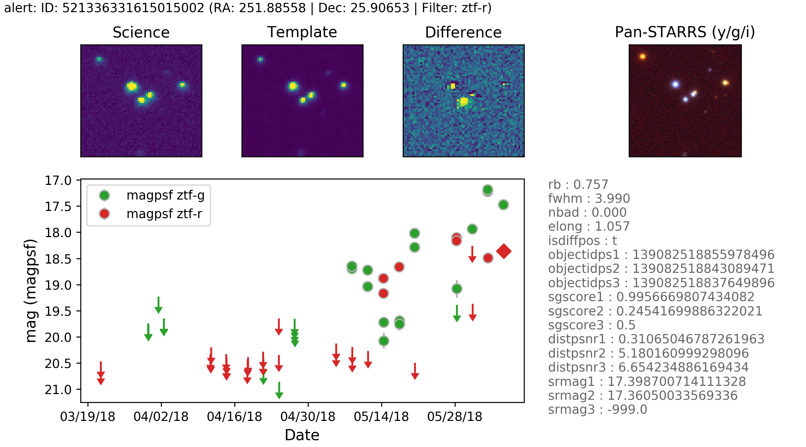

***
_alert.py documentation_
***

`ztfquery.alert.py` is module to visualise alerts generated by ZTF.

# Requirements 
- None
*** 


There is a simple library inside `ztfquery` to load, access and display ZTF alerts. 

# Reading Avro Alert


Assuming you have a `.avro` alert stored in you computer at `full_path_to_avro` then:
```python
from ztfquery import alert
ztfalert = alert.AlertReader.load(full_path_to_avro)
```
Inthere, the alert itself is stored as `ztfalert.alert`.  
Now, if you want  to display the alert for instance, simply use the `show()` method.

You can also quickly display the alert by using the `display_alert`:
```python
from ztfquery import alert
fig = alert.display_alert(full_path_to_avro, show_ps_stamp=True)
```


