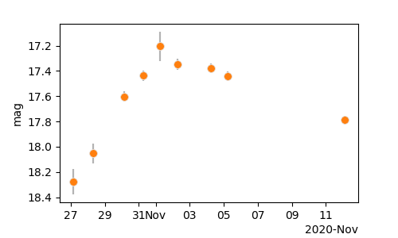
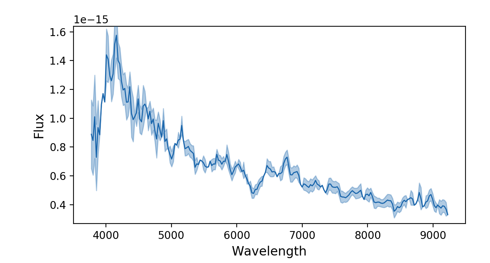

***
_fritz.py documentation_
***

`ztfquery.fritz.py` is module to access data from [fritz.science](https://fritz.science/).

# Requirements 
- You need an account on [fritz.science](https://fritz.science/) and you need to create a token from your [profile](https://fritz.science/profile)
- You need a `ztfquery` version >= 1.12.0

*** 

# Examples

## LightCurves and Photometry

```python
from ztfquery import fritz
lc = fritz.download_lightcurve("ZTF20acmzoxo", get_object=True)
# or if you already have done it and want the stored version:
# lc = fritz.get_local_lightcurve("ZTF20acmzoxo", directory="default")
lc.show()
```


The data downloaded from fritz are store, as pandas.DataFrame as `lc.data`:
```python
print(lc.data.columns)
> Index(['obj_id', 'ra', 'dec', 'filter', 'mjd', 'instrument_id',
       'instrument_name', 'ra_unc', 'dec_unc', 'origin', 'id', 'groups', 'mag',
       'magerr', 'magsys', 'limiting_mag'],
      dtype='object')
```

You can for instance get all the reported coordinates by doing:
```python
lc.get_coordinates(full=True)
> # DataFrame
              ra	dec
    0	331.205290	16.856651
    2	331.205307	16.856643
    4	331.205307	16.856643
    5	331.205293	16.856643
    6	331.205317	16.856641
    ...	...	...
    289	331.205293	16.856636
    290	331.205293	16.856636
    291	331.205295	16.856650
    292	331.205303	16.856639
    293	331.205295	16.856650
```
or get an estimation of the likely extact coordinate by taking a median of that:
```python
lc.get_coordinates(method="nanmedian")
> array([331.2052937,  16.8566374])
```
Finally, you can simply filter the input data using the get_data() method. Say you want the "i" band detected data from 22nd of Oct 2020 to 15th of Nov 2020:
```python
filtereddata = lc.get_data(filters="ztfi", detected=True, time_range=["2020-10-22", "2020-11-15"])
```
You can pass this filtering to the show() method:
```python
from ztfquery import fritz
lc = fritz.download_lightcurve("ZTF20acmzoxo", get_object=True)
lc.show(filtering= dict(filters="ztfi", detected=True, time_range=["2020-10-22", "2020-11-15"]) )
```


*I/O*: Use the `lc.store(fileout)` to store the lightcurve. (calling `spec.to_csv`, `spec.to_hdf` or `spec.to_json` depending on the extension given) 

## Spectra

```python
from ztfquery import fritz
spec = fritz.download_spectra("ZTF20acmzoxo", get_object=True, dirout="default")
# or if you already have done it and want the stored version: 
# spec = fritz.get_local_spectra("ZTF20acmzoxo", directory="default")
spec.show()
```
<p align="left">
  
</p>


The data downloaded from () are stored as `spec.fritzdict`:
```python
print(spec.fritzdict.keys())
> dict_keys(['created_at', 'followup_request_id', 'modified', 'assignment_id', 'wavelengths', 'altdata', 'fluxes', 'original_file_string', 'errors', 'original_file_filename', 'obj_id', 'owner_id', 'observed_at', 'id', 'origin', 'instrument_id', 'groups', 'instrument_name', 'reducers', 'observers'])
```

An pyifu.Spectrum object is created as spec.spectrum (from which the aforementioned `show()` comes from). It contains methods like `spec.spectrum.synthesize_photometry(filter_wave, filter_trans)` or `spec.spectrum.scale_by(flux_or_array)`.

*I/O*: Use the `spec.store(fileout)` to store the spectrum. (calling `spec.to_fits`, `spec.to_ascii`, `spec.to_json` or `spec.to_txt` depending on the extension given) 


## FritzAccess

`FritzAccess` is a general user-based access to Fritz. The mostly enables you to access the sources associated to your groups.

```python
faccess = fritz.FritzAccess()
```
Load your group (loading the `faccess.groups` FritzGroups object, see download_groups())
```python
faccess.load_groups()
```
the groups you have access to are:
```python
print(faccess.groups.accessible)
> # DataFrame
       nickname	       modified	              id	name	       single_user_group	created_at
0	infant	2020-10-21T06:20:34.549465	49	Infant Supernovae	False	2020-10-21T06:20:34.549465
...
4	SNeIa	2020-11-15T09:33:18.151551	177	Type Ia Supernovae	False	2020-11-15T09:33:18.151551
```
and to get the sources associated to a group (might be slow). 
```python
faccess.load_sources("SNeIa")
```
You can load several groups one at the time or together by providing a list like `faccess.load_sources(["infant","SNeIa"])`
to get load sources be only from one group:
```python
source_df= faccess.get_group_sources("SNeIa")
print(source_df.keys())
> Index(['id', 'origin', 'dist_nearest_source', 'ra_dis', 'internal_key',
       'mag_nearest_source', 'dec_dis', 'detect_photometry_count',
       'e_mag_nearest_source', 'ra_err', 'created_at', 'transient', 'dec_err',
       'modified', 'varstar', 'offset', 'ra', 'is_roid', 'redshift', 'dec',
       'score', 'redshift_history', 'altdata', 'thumbnails', 'comments',
       'classifications', 'annotations', 'last_detected', 'gal_lon', 'gal_lat',
       'luminosity_distance', 'dm', 'angular_diameter_distance', 'groups'],
      dtype='object')
```

### `FritzAccess.get_target_{}`

Finally, you have `faccess.get_target_{}([options])` methods where {} could be `classification`, `coordinates`, `redshift`, `jdrange` and `data`.

You have in addition `faccess.get_target_metadataquery()` that you can directly pass to ZTFQuery.load_metatable() to download IRSA data associated to this source.

### `FritzAccess.load_local()`

Since downloading sources could be very slow, every time you do that, the data are stored locally as `$ZTFDATA/fritz/{groupname}_sources.csv`. If you are happy with accessing the stored versions, simply do:

```python
from ztfquery import fritz
faccess = fritz.FritzAccess.load_local()
```
(you can still do `facces.load_sources(groupname)` to download the latest version, which will automatically be stored, updating `$ZTFDATA/fritz/{groupname}_sources.csv`).

## Source(s)

## Alerts

## Groups

***

# Structure

With `ztfquery.fritz.py` you can download and store locally **lightcurve**, **spectra**, **alerts**, **sources** and **groups** information. 
For convinience, each of these have a dedicated python object, e.g., `FritzSpectrum`, `FritzGroups` or `FritzPhotometry`.

`ztfquery.fritz.py` has global functions for quick access: 
- For downloading: `download_{}`
- For getting local data: `get_local_{}`


## Downloads
The functions are called `download_{}`:
- `download_lightcurve(source_name, [option])`
- `download_spectra(source_name, [option])`
- `download_alerts(source_name, [option])`
- `download_source(source_name, [option])`
- `download_sources([option])`
- `download_groups([option])`

See the [option] to get details but each should have at least the following:
- `token`: you can directly provide a token. If not, the first time, this will call for you token (see [your profile](https://fritz.science/profile)). I will store it in ~/.ztfquery
- `get_object`: Set that to True to for the dedicated FritzObject implemented in `ztfquery.fritz.py`, if not, this returns the direct download.
- `dirout`: Directory where the data are stored. None means no storing at all and 'default' is the ztfquery default structure (highly recommanded).

## Get Local
Similarly as `download_{}` you can access your local files (already downloaded) using the corresponding `get_local_{}`


