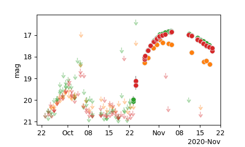

***
_fritz.py documentation_
***

`ztfquery.fritz.py` is module to access data from [fritz.science](https://fritz.science/).

# Requirements 
- You need an account on [fritz.science](https://fritz.science/) and you need to create a token from your [profile](https://fritz.science/profile)
- You need a `ztfquery` version >= 1.12.0

# Structure

With `ztfquery.fritz.py` you can download and store locally **lightcurve**, **spectra**, **alerts**, **sources** and **groups** information. 
For convinience, each of these have a dedicated python object, e.g., `FritzSpectrum`, `FritzGroups` or `FritzPhotometry`.

`ztfquery.fritz.py` has global functions for quick access: 
- For downloading: `download_{}`
- For getting local data: `get_local_{}`


## Downloads
The functions are called `download_{}`:
- `download_lightcurve(source_name, [option])`
- `download_spectra(source_name, [option])`
- `download_alerts(source_name, [option])`
- `download_source(source_name, [option])`
- `download_sources([option])`
- `download_groups([option])`

See the [option] to get details but each should have at least the following:
- `token`: you can directly provide a token. If not, the first time, this will call for you token (see [your profile](https://fritz.science/profile)). I will store it in ~/.ztfquery
- `get_object`: Set that to True to for the dedicated FritzObject implemented in `ztfquery.fritz.py`, if not, this returns the direct download.
- `dirout`: Directory where the data are stored. None means no storing at all and 'default' is the ztfquery default structure (highly recommanded).

## Get Local
Similarly as `download_{}` you can access your local files (already downloaded) using the corresponding `get_local_{}`


# Examples

Download a lightcurves:

```python
from ztfquery import fritz
lc = fritz.download_lightcurve("ZTF20acmzoxo", get_object=True)
lc.show()
```


