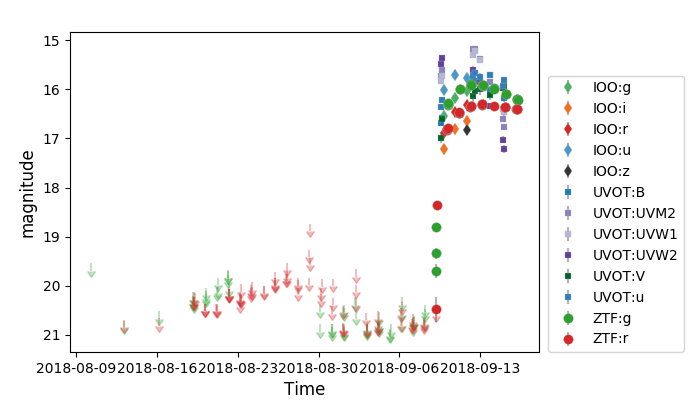

***
_marshal.py documentation_
***

`ztfquery.marshal.py` is module to access data from the [ZTF-I marshal](http://skipper.caltech.edu:8080/cgi-bin/growth/marshal.cgi).

# Requirements 
- You need an account on [ZTF-I marshal](http://skipper.caltech.edu:8080/cgi-bin/growth/marshal.cgi) 
- You need a `ztfquery` version >= 1.2.0

*** 


# Getting Marshal Data


You can query data stored in the Marshal directly from `ztfquery`.

There are three main utilities:
1. Getting target datatable (coordinates, classification, redshift etc) 
2. Getting target spectra
3. Getting target lightcurves

All of these could be called from `MarshalAccess`, but 2. and 3. (spectra and lightcurves) can directly be downloaded and retrieve from you computer 
as `ztfquery.marshal` function (i.e. with no need to instanciate a `MarshalAccess` object). Below are some examples.

**password protection:** Data right access to the Marshal could directly be passed into functions and methods (using the `auth` argument) or, as usual and as favored, stored crypted into `~/.ztfquery`. The first time you will query for marshal information without explicitly providing an authentification using `auth`, `ztfquery` will prompt for your marshal username and password and will store save. Then anytime `auth` is not given, the username and password stored will be used. 

# Getting Marshal target information
```python
from ztfquery import marshal
# This instanciates a MarshalAccess object
m = marshal.MarshalAccess()
# Then downloads all targets you have access to. 
m.load_target_sources()
# Target data are stored as a pandas DataFrame into `target_sources`
print(m.target_sources)
> # Dataframe containing:
[candid, name, ra, dec, classification, field, redshift, creationdate, iauname, id, lastmodified, rcid, release_auth, release_status]
```

## Get all sources associated to your marshal program(s)
You can also download target sources only for one of you program using the `program` arguments, for instance:
```python
from ztfquery import marshal
m = marshal.MarshalAccess()
m.load_target_sources(program="Cosmology")
```

### Fast loading using load_local()
If you already have loaded the target sources once, the latest version of it is stored locally in your computer (see `$ZTFDATA/marshal`). To retreive it without having to download the sources from the marshal (which is slow), simply do:
```python
from ztfquery import marshal
m = marshal.MarshalAccess.load_local() # you can get specified program.
```
Remark that this is not the latest marshal source list, but the latest you downloaded.


## Get target data
If you only want a subgroup of targets, you can use the `get_target_data()` method:
```python
m.get_target_data(["SN2018zd","ZTF18aahflrr","at2018akx"])
"""
a table containing:
'candid name ra dec classification field redshift creationdate  iauname id lastmodified  rcid  release_auth release_status'
only for the given targets
"""
```

You can also directly get their coordinates, redshift or classification (`get_target_{coordinates,redshift,classification}`) e.g.:
```python
m.get_target_coordinates(["SN2018zd","ZTF18aahflrr","at2018akx"])
"""
	ra	dec
0	94.513250	94.513250
2	150.846667	-26.182181
3	153.923187	14.119114
"""
```
_Remark:_ getting information (coordinates, redshift etc) for 1 or 1000 targets roughly takes the same amount of time, so better query all your targets at once.

# Getting Marshal spectra

You can download target spectra stored in the marshal using the `download_spec` function. 
For instance:
```python
from ztfquery import marshal
marshal.download_spectra("ZTF18abcdef")
```
As such, spectra will be stored in `$ZTFDATA/marshal/spectra/TARGET_NAME/`.
If you want to provide another directory, simply fill the `dirout` argument, for instance:
```python
from ztfquery import marshal
marshal.download_spectra("ZTF18abcdef", dirout="ANY_DIRECTORY_PATH")
```

You may also want to directly get the data (i.e. not storing them somewhere), then set  `dirout=None`
```python
from ztfquery import marshal
spectra = marshal.download_spectra("ZTF18abcdef", dirout=None)
```
Here, `spectra` is a dictionary with the following structure: `{filename_: readlines_array_of_ascii_spectraldata}`

If you have dowloaded spectra using the default dirout output (`dirout='default'`), you can load the spectra using `get_local_spectra(TARGET_NAME)`, which returns the same `dict` as defined just above (`{filename_: readlines_array_of_ascii_spectraldata}`)


# Getting Marshal lightcurves

Similarly to the spectra, you can download the marshal lightcurve using the  `download_lightcurve` function.
```python
from ztfquery import marshal
marshal.download_lightcurve("ZTF18abcdef")
```
`download_lightcurve` has the same `dirout` option as `download_spec`, except that it saves lightcurve by default in `$ZTFDATA/marshal/lightcurves/TARGET_NAME/`. Use `get_local_lightcurves()` function to retreive lightcurve downloaded using `dirout="default"`. 

Lightcurves are stored as .csv and returns as pandas DataFrame. You can directly visualize the lightcurve using `plot_lightcurve(lc_dataframe)` providing the pandas DataFrame. 

```python
from ztfquery import marshal
# Download lightcurve of 

marshal.download_lightcurve("ZTF18abcdef")
# Loading it // this returns a dict with the format {filename: DataFrame} because one could have saved several .csv.
lcdataframe = marshal.get_local_lightcurves("ZTF18abcdef")
# Plot it
marshal.plot_lightcurve(lcdataframe)
```


