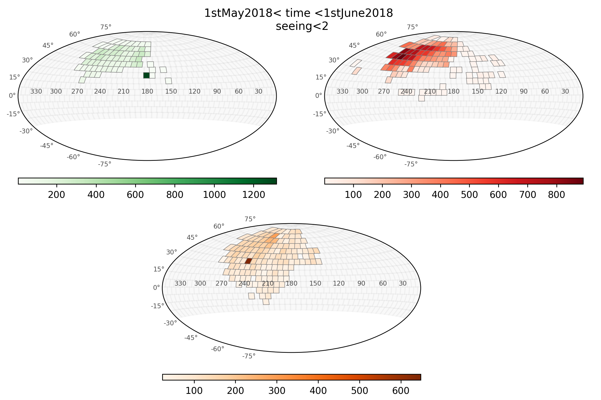

***
_query.py documentation_
***

`ztfquery.query.py` is module to access ZTF data [IRSA]((https://irsa.ipac.caltech.edu/)


***

# Requirements 
- You need an account on [IRSA]((https://irsa.ipac.caltech.edu/) and, if you need access to private data, this account must be associated to ztf. 

# Remark
- you can have access to the public ZTF data, see [DR3](https://www.ztf.caltech.edu/news/public-data-release-3)
- reminder to set the global variable `$ZTFQUERY` (see [installation](https://github.com/MickaelRigault/ztfquery/README.md).
*** 

# Accessing ZTF data.

Finding the ztf data requires two step:
  1. do the query to know which data are accessible: this uses the `load_metadata()` method
  2. do the actual download of the accessible data: this uses the `download_data()` method.

The metadata structure is detailed here: [ztf_api](https://irsa.ipac.caltech.edu/docs/program_interface/ztf_api.html)

## Generic SQL, no coordinate in particular.

In this example, we are going to query any thing that have been observed with a *seeing lower than 2arcsec between the 1st of May 2018 and the 1st of June 2018*.
```python
from ztfquery import query
zquery = query.ZTFQuery()
# Check what are the Julian Dates of 1st of May 2018 and 1st of June 2018
from astropy import time
jdstart = time.Time("2018-05-01").jd
jdend = time.Time("2018-05-15").jd 
# Do the Query to see what exists
zquery.load_metadata(sql_query=f"seeing<2 and obsjd BETWEEN {jdstart} AND {jdend}") # this may take some time.
```
The information is save as Pandas DataFrame undern `metatable`
```python
zquery.metatable # it contains about 50 000 entries...
```

Show the observed fields, limiting it to the main (or primary) grid for visibility (say grid="secondary" to see this rest):
```python
zquery.show_gri_fields(title="1stMay2018< time <1stJune2018 \n seeing<2", grid="main")
```


## Query data for a given coordinate with filter and time constraints. 

In this second example, we will want to access *the I-band filter (filter #3) observations within 0.01 degree around RA=276.107960 Dec=+44.130398 since the 14th of May 2018*.

```python
from ztfquery import query
zquery = query.ZTFQuery()
# Print what are the Julian Dates of 14th of May 2018
from astropy import time
starttime = time.Time("2018-05-14").jd
# Do the Query to see what exists
zquery.load_metadata(radec=[276.107960,+44.130398], size=0.01, sql_query=f"fid=3 and obsjd>{starttime}") # takes a few seconds
# As of when the README has being written, this had 8 entries:
zquery.metatable
"""
	obsjd	ccdid	filtercode
0	2.458268e+06	1	zi
1	2.458268e+06	15	zi
2	2.458256e+06	15	zi
3	2.458255e+06	1	zi
4	2.458262e+06	1	zi
5	2.458273e+06	1	zi
6	2.458262e+06	15	zi
7	2.458273e+06	15	zi
"""
```


## Getting reference image for a given coordinate

Let's imagine you want have a target at a given coordinate RA=276.107960 Dec=+44.130398. You want the reference image associated to it.

To get the reference image metadata simply do:
```python
from ztfquery import query
zquery = query.ZTFQuery()
zquery.load_metadata(kind="ref",radec=[276.107960, +44.130398], size=0.0001)
zquery.metatable[["field","filtercode", "ccdid","qid"]]
"""
	field	filtercode	ccdid	qid
0	764		zg	1	3
1	726		zr	15	2
2	726		zg	15	2
3	726		zi	15	2
4	764		zr	1	3
5	764		zi	1	3
"""
```


If you only want reference images of for "g" filter:
```python
zquery.load_metadata(kind="ref",radec=[276.107960, +44.130398], size=0.0001,  sql_query="fid=1")
```
or, instead of `sql_query="fid=1"`, you could use `sql_query="filtercode='zg'"` but be careful with the quotes around _zg_

You can then simply download the refence image by doing `zquery.download_data()` as detailed below.

# Downloading the Data

The actual data download is made possible after you did the `load_metadata()` (see above) 

## Dowloading data associated to a given position in the sky

In this  example, we will want to access *All observations within 0.01 degree around RA=276.107960 Dec+44.130398 since the 14th of May 2018 with a seeing lower than 2arcsec*.

```python
from ztfquery import query
zquery = query.ZTFQuery()

# Step 1, load the meta data (NB: Julian Date of 14th of May 2018 is 2458252.
zquery.load_metadata(radec=[276.107960,+44.130398], size=0.01, sql_query="seeing<2 and obsjd>2458252.5")
# As of when the README was being written, this had 42 entries (only partnership data)
zquery.metatable[["obsjd", "seeing", "filtercode"]]
"""
	obsjd	seeing	filtercode
0	2.458277e+06	1.83882	zr
1	2.458277e+06	1.84859	zr
2	2.458268e+06	1.74317	zi
3	2.458269e+06	1.65564	zr
4	2.458267e+06	1.90791	zr
...
35	2.458253e+06	1.84952	zr
36	2.458273e+06	1.77137	zr
37	2.458270e+06	1.71865	zr
38	2.458274e+06	1.84936	zg
39	2.458270e+06	1.60568	zr
40	2.458253e+06	1.98775	zr
41	2.458275e+06	1.99942	zg
"""

# Downloading the Data
zquery.download_data("psfcat.fits", show_progress=False)
```

**You can download in multiprocessing** simply by adding the keywork `nprocess=X` where X is the number of parallel process you want. 
The `show_progress` option will then show the overall progress. 
For example:
```python
zquery.download_data("psfcat.fits", show_progress=True, notebook=True, 
                     nprocess=4, verbose=True, overwrite=True)
```
In the above example, `overwrite=True` enables to re-download existing file. 
By default `overwrite` is `False`, which means that the code checks if you already have the file you want to download where you want to download it and if so, skips it. `verbose` prints additional information like the name of files been downloaded.

**You can download simply a part of the data** (starting version >1.4.2): `download_data()` have an `indexes` options. Simply provide the indexes of the `metatable` you want to download, only these will be downloaded.
```python
zquery.download_data("psfcat.fits", indexes=[4,6,12,40])
```

_What is happening inside `download_data()`?_

For each observation made with ZTF (that you have queried using `load_metadata()`) there are plenty of data product made available. Here is the list for the science exposure (default of `load_metadata()`, details [here](https://irsa.ipac.caltech.edu/docs/program_interface/ztf_metadata.html)):

- sciimg.fits (primary science image)
- mskimg.fits (bit-mask image)
- psfcat.fits (PSF-fit photometry catalog)
- sexcat.fits (nested-aperture photometry catalog)
- sciimgdao.psf (spatially varying PSF estimate in DAOPhot's lookup table format)
- sciimgdaopsfcent.fits (PSF estimate at science image center as a FITS image)
- sciimlog.txt (log output from instrumental calibration pipeline)
- scimrefdiffimg.fits.fz (difference image: science minus reference; fpack-compressed)
- diffimgpsf.fits (PSF estimate for difference image as a FITS image)
- diffimlog.txt (log output from image subtraction and extraction pipeline)
- log.txt (overall system summary log from realtime pipeline)

In the above example, we have selected the catalog generated by PSF-fit photometry "psfcat.fits" ; the download of all the 42 catalogs took a couple of minutes ; images would be much slower.

_Where are the downloaded data  ?_

The data are saved following IRSA structure (default, see download_data option if you do not want that).

To retrieve them simply do:
```python
zquery.get_local_data("psfcat.fits")
```

**Important: Retrieving data** If you need to get them again later on, after you closed the session, you will need to redo the `load_metadata()` query to find back the structure of the database, otherwise `get_local_data()` will not know what to do. 
If you need to work offline, I suggest you overwrite the download location within `download_data` using the 'download_dir' option. If provided, all the data will be dumped inside this directory without following the IRSA structure.

